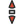

# numix-cursor
An X-cursor-theme for use along with the numixproject products.

This is version 0.9.0 and there is still a lot to discuss. Please install the cursor and play a bit with it. Then
tell me, whether you like it or not and what you would prefer to be changed to suit the numix design. 
I additionally updated this to gnome-look.org (and variants) to see what the community says about it.

This theme is tested only under Ubuntu with the Unity desktop, but should work fine with all of its' most popular desktop derivates. (KDE, xfce, lxde)

For the moment, the only size supported is 24px and one color scheme.
I generated all the x-cursor files and png images by hand, for the design I used Inkscape. For the links in the src directory, I used the most popular x-cursor themes on gnome-look.org.

I will be working on proper bash scripts for png and cursor generation to minimize the work. (I could probably use some help here, because I am new to bash scripting).

## Current design preview

## Installing

1. Download or clone this repository to any location
2. From that directory:
3. Run automate.sh and follow the prompts. Files will be automatically generated, and copied to your ~/.icons directory.
4. Use Tweak-Tool and select "Numix-Cursors" as your cursor theme.

Enjoy!

## NOTE: 
if you wish to edit the files manually using inkscape (currently only working method) copy the files in /default to /src and make
your edits then run generate-only.sh to convert, generate, and install cursors.
