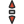
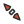
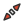
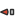

# Custom-Cursors
An automated, customizable X-11 Cursor theme!

This is version 0.9.5, we've got the script to automatically generate all the files you need and install them
for you. We're currently working on automating the theming process itself.

This theme is tested only under Ubuntu with the Unity desktop & Arch with the Gnome desktop, but should work fine under
other distros. You may just have to tweak where the files are installed to (or just use a symlink to link the two
directories, ie ln -S ~/.icons/Numix-Cursor [path-they-should-be-installed])

For the moment, the only size supported is 24px and the orange color is customizable.

Original .cursor and .svg images used were created, manually, by uloco using Inkscape and a text editor.

## Current design preview

## Installing

1. Download custom-cursors.tar.gz from the repo and extract to any directory
2. From that directory:
3. Run automate.sh and follow the prompts. Files will be automatically generated, and copied to your ~/.icons directory.
4. Use Tweak-Tool and select "custom-cursors" as your cursor theme.

Enjoy!

## NOTE: 
if you wish to edit the files manually using inkscape extract the src.tar.gz archive, make your edits then run generate-only.sh
